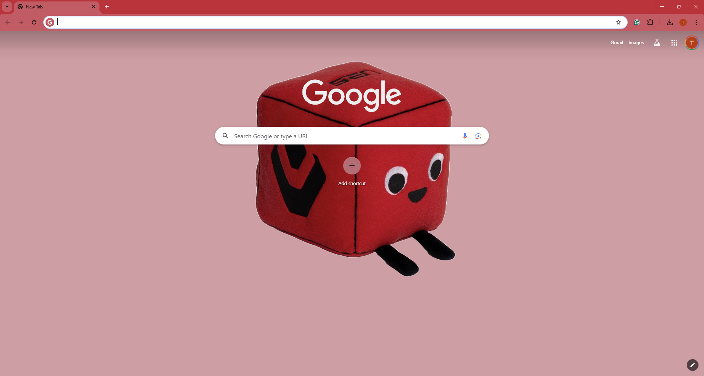
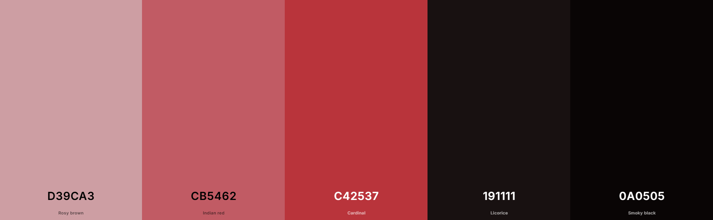

# GSOC25-ChromeTheme: Sentinels Valorant 🔥💥

A cute, Sentinels Valorant Google Chrome theme for the starter task of GSOC25 Chromium: Add 3rd Party Theme Support for Tab Groups. This Chrome theme is inspired by the popular franchised organizations in Valorant, Sentinels.

## Theme Preview

### Color Palette

## HOW TO:

### Running Theme With Source Code (Unpacked):

1. To retrieve the unpacked source code, `git clone https://github.com/timothyouu/GSOC25-Sentinels-ChromeTheme.git` or download the `Unpacked` folder in this directory
2. In a Chrome browser, visit `chrome://extensions/`
3. Toggle on 'Developer Mode'
4. Click on the 'Load unpacked' button and upload the `Unpacked` folder, this will install the theme to your Chrome browser

## Editing This Theme:

1. `git clone https://github.com/timothyouu/GSOC25-Sentinels-ChromeTheme.git` and go to `Unpacked` folder for source code
2. In `manifest.json`, you can make changes to colors and images/image positions by editing the values of the associated attributes in the `theme` JSON object:
   - `colors`: Changes main colors of browser UI components such as frame, toolbar, or component text colors.
   - `tints`: Changes hue, saturation, and lightness of UI components, such as buttons.
   - `images`: Changes the new tab page background image.
   - `properties`: Changes alignment of the main image in new tab page.

## Credits:

- [Cubert Image](Unpacked/images/cubert.png):
  - Image Credit: [Sentinels Shop](https://shop.sentinels.gg/cdn/shop/files/image_1.jpg?v=1731027165&width=3840).
  - Background removed with: [Online background remover](https://www.adobe.com/express/feature/image/remove-background)
- Theme: Created by [timothyouu](https://github.com/timothyouu)
